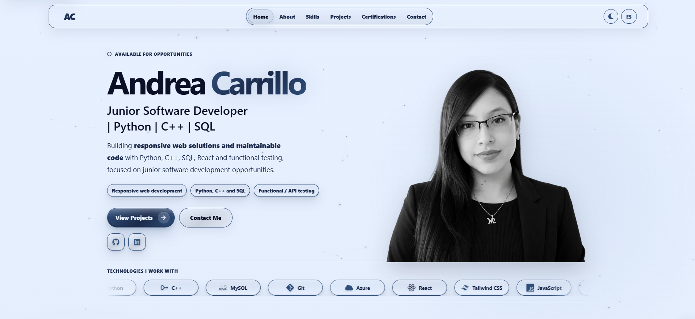

# Andrea Carrillo Portfolio

[](https://react.dev/)
[](https://vite.dev/)
[](https://www.i18next.com/)
[](https://pnpm.io/)
[](https://www.netlify.com/)
[](#accessibility-and-quality)

Professional bilingual portfolio for **Andrea Carrillo Oporto**, focused on **Software Developer** opportunities with emphasis on **Python, C++ and SQL**.

This project was built as a production-ready personal portfolio with a responsive hero section, light and dark themes, accessibility-focused styling, technical SEO, and deployment support for Netlify.

## Screenshots

### Light mode



### Dark mode


## Features

- Responsive one-page portfolio built with **React + Vite**.
- Bilingual content with **i18next**.
- Accessible color system aligned to **WCAG AA**.
- Light and dark themes with smooth transitions.
- Responsive hero layout optimized for **mobile, tablet and desktop**.
- Transparent portrait assets with optimized responsive WebP images.
- Project cards with repository links and live demos where available.
- Technical SEO: canonical URL, Open Graph, Twitter Card, JSON-LD, robots and sitemap.
- Netlify-ready configuration with SPA redirects, headers and production build support.
- Automated palette and contrast validation scripts.

## Tech stack

### Frontend
- React 19
- Vite 6
- JavaScript (ES Modules)
- Custom CSS

### Internationalization
- i18next
- react-i18next
- i18next-browser-languagedetector

### UI and utilities
- React Icons
- pnpm

### Deployment and quality
- Netlify
- ESLint
- Custom scripts for contrast, palette and deploy file generation

## Project structure

```text
Portfolio_Plantilla_Professional/
├── docs/
│   └── screenshots/
│       ├── home-dark.png
│       └── home-light.png
├── public/
│   ├── apple-touch-icon.png
│   ├── favicon.png
│   ├── og-image.jpg
│   ├── robots.txt
│   ├── sitemap.xml
│   └── images/
│       └── responsive/
├── scripts/
│   ├── check-contrast.mjs
│   ├── check-palette.mjs
│   └── generate-deploy-files.mjs
├── src/
│   ├── assets/
│   ├── components/
│   ├── i18n/
│   ├── styles/
│   ├── App.jsx
│   ├── constants.js
│   └── main.jsx
├── .env.example
├── .gitignore
├── .nvmrc
├── netlify.toml
├── package.json
├── pnpm-lock.yaml
└── vite.config.js
```

## Getting started

### Requirements

- **Node.js 20+**
- **Corepack enabled**
- **pnpm 9.15.0** or compatible

### Installation

```powershell
corepack enable pnpm
corepack install --global pnpm@9.15.0
pnpm install
```

### Development

```powershell
pnpm dev
```

### Production build

```powershell
pnpm build
pnpm preview
```

## Available scripts

```powershell
pnpm dev
pnpm lint
pnpm build
pnpm preview
pnpm palette
pnpm contrast
pnpm check
```

### What they do

- `pnpm dev` → starts the local Vite development server.
- `pnpm lint` → runs ESLint.
- `pnpm build` → generates the production build and deploy files.
- `pnpm preview` → previews the production build locally.
- `pnpm palette` → validates that the approved palette is respected.
- `pnpm contrast` → checks color contrast ratios.
- `pnpm check` → runs the full validation pipeline.

## Accessibility and quality

This project was prepared with a quality baseline suitable for publication:

- Semantic HTML structure.
- Keyboard-focus visibility.
- Support for `prefers-reduced-motion`.
- Contrast verification aligned with **WCAG AA**.
- Controlled design palette.
- Responsive hero section tuned for desktop, tablet and mobile.
- Clean deliverable without `node_modules`, `dist` or local environment artifacts.

## Deployment on Netlify

The project is ready to be imported directly into Netlify.

### Expected settings

- **Build command:** `pnpm build`
- **Publish directory:** `dist`
- **Node version:** `20`
- **Package manager:** `pnpm`

Netlify reads the configuration from `netlify.toml`. The deploy step also regenerates the SEO files using the production URL provided by Netlify.

For step-by-step deployment instructions, see:

- `docs/NETLIFY_DEPLOYMENT.md`

## SEO

The project includes:

- Canonical URL handling
- Open Graph tags
- Twitter Card tags
- JSON-LD structured data
- `robots.txt`
- `sitemap.xml`
- Optimized social preview image

## License

This portfolio is shared as a personal/professional project for presentation purposes.

---

Created by **Andrea Carrillo Oporto**.
